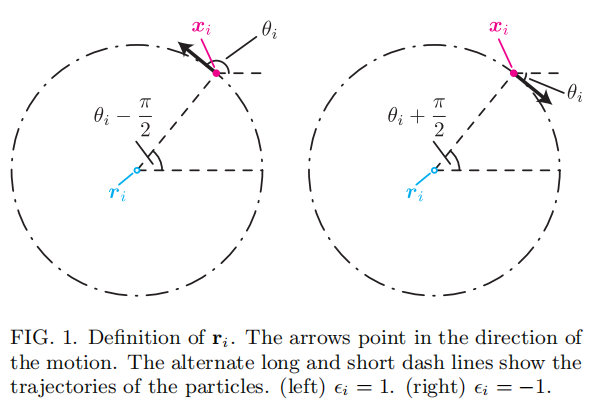

# The Model
$$
\begin{aligned}
	\dot{\mathbf{x}}_i&=\mathbf{e}_{\theta _i}\;,\\
	\dot{\theta}_i&=\omega _i\left( t \right) +\frac{\alpha}{\mathcal{N} _i}\sum_{\left| \mathbf{x}_j-\mathbf{x}_i \right|<1}{\sin \left( \theta _j-\theta _i \right)}\;.\\
\end{aligned}
$$

$\omega_i$: a telegraphic noise with the value of $\pm \omega_0$ switching at rate $\tau^{-1}$ (average waiting time is $\tau$).

## Dynamics of Centers 

centers: $1$